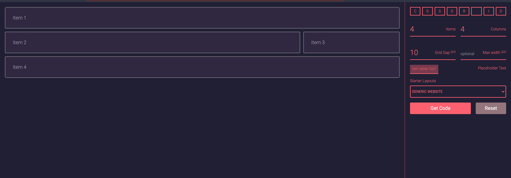
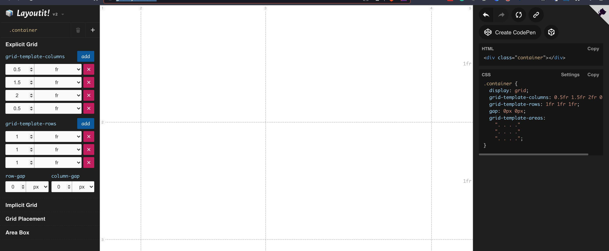
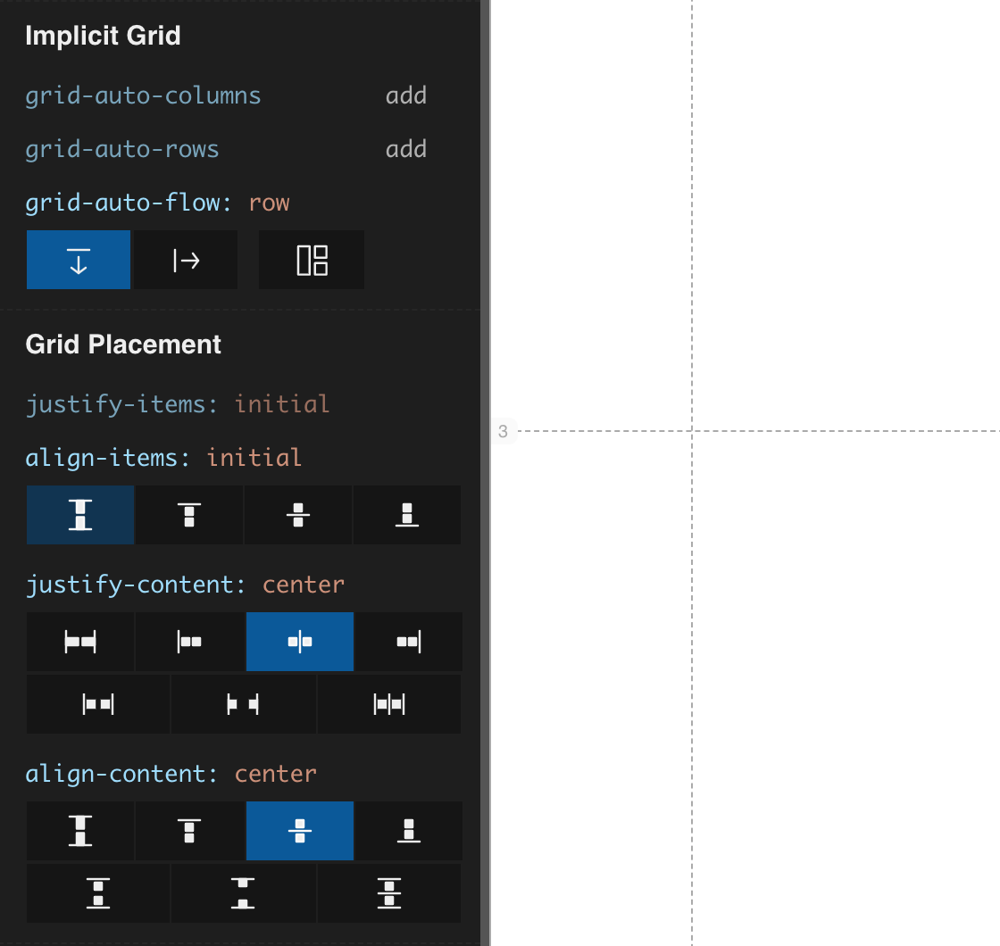

Originally, the CSS Grid used on my homepage came from a [Frontend Masters course]() where I 
learned most of what I know about CSS layouts...which is not much. I'm definitely a "work smart, 
not hard" type of person so I only learn enough of what I need to get the job done.

After completing a few blog posts and continuing to stare at the half-done grid, I began to 
think I had too many sections on the grid. In total, I had 13 sections but only really something 
going on in six of them.


Couple that with the fact that I'm sending out my resume to prospective employers, and I felt 
like a big idiot for not having half of the sections filled in. Most of the time, employers 
expect your personal site to be completely done or at least not look broken, and my site gave an 
impression that I have big ideas but can't actualize them fully.

In this post, I will go over converting my copy/paste CSS grid to one I design that only 
includes the six or so sections I need to have. I will also re-arrange the grid from mobile to 
desktop breakpoints, which is one of the best features of CSS Grid IMHO: you can lay out the 
HTML and position the content solely via CSS.

## Online CSS Grid Generators

After narrowing down my set of sections from 13 to six, I stared at my screen wondering 
how I was going to re-create the grid. I kept trying to mentally place the blocks in the same 
structure but different places. It was hard to conceptualize a new grid while staring at the old 
one.

On a whim, I decided to Google "online css grid generator" and to my chagrin, I found numerous 
options. I'll only go through a couple of them as an example, but it really helped me come up 
with a new design rather than starting from scratch.



The [third grid generator I saw](https://cssgr.id/) started with a pretty basic setup: the 
traditional website header, content, sidebar, and footer grid. While I didn't find the generator 
or template that inspiring, it did help me to remember what a normal homepage layout might look 
like after staring at my Frankenstein homepage grid.

After looking at that generator, I found several others that allowed more control over applying 
fractions to rows and columns you add, but none of them was that intuitive. 



That was until I got to a tool that allowed you to drag the columns and rows to visually look 
like you want rather than having to enter fractional values and then visually check if that's 
actually the measurements you want. I found it really simple to drag the columns and rows a few 
times to think through how I was going to re-arrange my homepage grid.



As a bonus, the grid builder from Layoutit included properties for placement of grid items, 
which are properties I always fumble with remembering how to center content or align an individual 
cell in the grid. It really helps to have the visual indicator of what the CSS property will end 
up doing with your grid.

I really wish those visual aides would pop up in my code editor when I'm writing CSS code. Just 
like tooltips that show you the definition of a function or class in your code, it would be 
great for the CSS property values to show what they visually will do, in general, when you place 
them on HTML elements...but a search for that implementation will be saved for another day. 

## Generated CSS Grid Code

After messing around with the CSS grid tool I liked best, I was able to nicely export generated 
CSS that I can place in my project's main CSS file.

```css
.container {
  display: grid;
  grid-template-columns: 0.5fr 1.5fr 2fr 0.5fr;
  grid-template-rows: 1fr 1fr 1fr;
  gap: 8px;
  grid-auto-flow: row;
  justify-content: center;
  align-content: center;
  grid-template-areas:
    ". . . ."
    ". . . ."
    ". . . .";
}
```

I ended up with a 4x3 grid system where I will use the `grid-template-areas:` property to lay out 
my grid via named CSS classes. Before, I was using `grid-column:` and `grid-row:` on individual 
CSS classes, but that makes it much harder to know where each section lives from the initial 
grid definition. Also, you can use media queries to re-arrange the grid and only have to do that 
in one place. 


